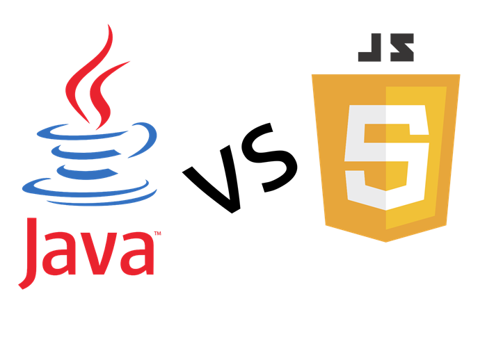

## Javascript Reflection 
   Currently, I am learning Javascript in my ICS 314 class at Univerisity of Manoa. Before this class, I had no prior knowledge to JavaScript and the only language that I have learned/practiced was Java. One could say that Java and Javascript are very similar and I can see it. Javascript is the distant cousin of Java and both of both are Object Oriented Programming languages (OOP). With that many of the language of Java can be seen when coding in Javascript. Since I learned Java beforehand, learning the basics of JavaScript went pretty smoothly to me but it is a known concept that JavaScript is more easily understood than that of Java. 

## Is Javascript a useful language? 
   I've only gone with the basics of JavaScript. But with my fair share of reasearch and diving in to future topics of JavaScript. I can say that JavaScript is useful as a beginning language. Learning the simple language first can help you learn different languages much faster. Take me for example, I had no prior programming knowledge before learning Java and it took me some time to get a hand of it. Now when learning JavaScript I can see that I am picking up the basics of that language in a much faster pace than when I was learning Java. Picking up more languages will help you learn other languages, maybe harder, much faster. Getting experience is always a must. Thats why interships are a thing. Now, if you are a web developer, JavaScript is a must language to know. Since most websites support JavaScript, you will need to know it in order to create your websies. 

## Class Structure Review 
   In our ICS 314 class, we have the idea of athletic software engineering. This is where you take the idea of being an athlete training in a sport. You train and practice to prepare for the big game/competition. The more you train, the better the performance at the big day. When applying this in an education standpoint. The idea of athletic learning is to pratice problems and learn from doing those problems. Repeat doing those problems or similar problems and you gain experience/skills in solving those problems. These new insights is what will help shape your knowledge in dealing with future problems. To me, being a student althlete before, I find that this style of learning might be fitted for me. If programming is a sport that I love to do, then I would enjoy spending hours of practice because I would like to become a professional. You could not go wrong with practicing a lot. 
