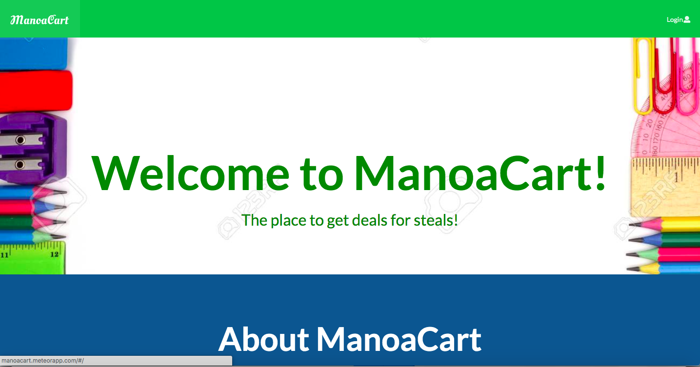
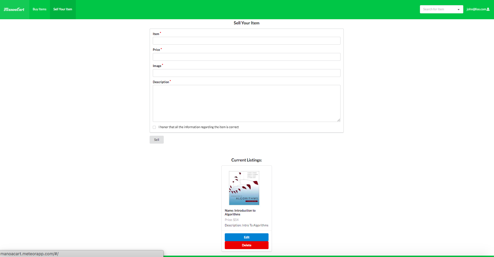

In the class ICS 314 at the University of Manoa, the final project is to get into teams of three to five classmates and create a website application together. Our "company" is Aloha Supply Co. and our product name is Manoa Cart. The team consists of me, Eddie Wen, Derrick Luyen, Gum San Aung, and Ryan Ganiron. In our application, users are able to use the website to buy and sell products relating to school. These could be textbooks, laptops or books relating to classes at UH. This website is to serve as a cheaper alternative to getting school supplies because we all know they can get very expensive. 

  

When going into the landing page of the website, you will be taken to the website home page to where users can find information about what our website is about. Users can either sign up for an account or log in if they have an existing account. When signing up, they must provide a UH email because this service is only limited to UH students for now. When the account is made, you can edit your profile and add a profile picture when needed. You can navigate through the website by the navbar. You can sell items by filling out a form, when filled out with the correct information, it will display in the buying page. When you click buy on the item, it will take you to another page where you can notify the seller that you are interested in the item, report the seller or review the seller. 

  

For this application, my main contributions was to implement the back end for the buying and selling page. By this, I mean having to create the page for selling, creating the item schema with an item collection to hold all the items. With the collection, you are able to see your items currently being sold on the selling page and you are able to see all the items being sold by different users on the buying page. Each item is equipped with their retrospective buttons like "buy" or "edit" or "delete item". Other contributions would be adding in a pop up menu of when you sell an item or if you delete it. Also adding in the functionality of the admin role only accounts in the navbar. I also added the sort by button in the buying page that sorts the items in alphabetical order or from lowest price to highest price.  

What I learned from my experience in creating this website application is a better understand of how to work on big projects with a group of people. Obviously, coding on the same project at the same time caused conflicting issues and learning how to overcome that was a great lesson for me. I've also been able to hone my website coding skills.  

More information on our app [here.](https://aloha-supply-co.github.io/).

