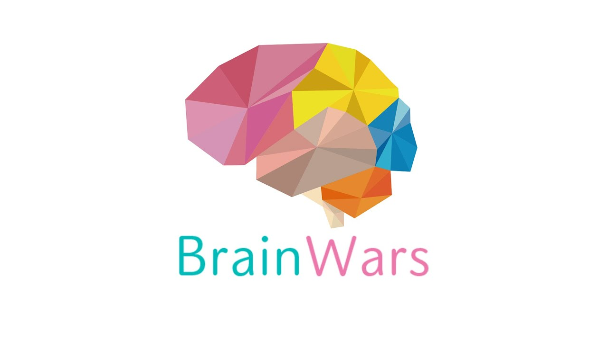
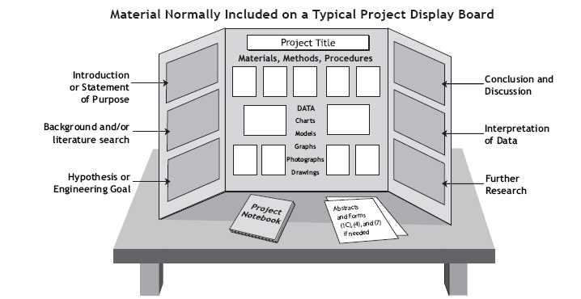

  
  

Every year, the Science Fair committee holds a fair for mostly all highschools and middleschools across the state. Here students would form a team of two and think of their own unique research topic. Once they thought of a research topic the do an experiement according to that topic. They would first do a hypothesis of what the outcome of the experiement will be. After that, an experiement is done to try and prove that hypothesis. You would then state the results and see if your hypothesis is correct. Explanation on to why the results turn out the way they did is needed after. After all that is done, you would have to put all that information on a board and present it to judges that would like to view your project. Depending on what the judges like, you move on to compete with other highschools and then states. 

For the Science Fair, me and my labmate decided on the topic of which gender has the faster reaction time, male or females? Our hypothesis on this was that males would have the faster reaction types because they tend to be on more of the athletic side. To keep our variables in check, we decided to only do this experiement on people around our age because we knew different ages would affect the reaction times. We also had to keep in mind the environment the test subjects were in when taking the experiment test. We decided to do it only in the same empty classroom. The tests included games from an app called "Brain Wars". This app had everything we needed from testing which color pop ups first, to the light that lights up first. We would record the time it takes for each subject to finish the steps and take the average of that. It turns out that after running the experiement on 15 guys and girls, the males had a faster reaction time than the females. My main role in this was to perform the experiment, get the results and my lab partner made the board. During the time we waited for judges to come take a look at our work, we noticed that many judges that came to look were all females. All was shock that females didn't have the faster reaction time. At the end, me and my lab partner made it to the regionals because the judges thought that our project could have potential in making our bodies advance in ways that make it better. Unfortunately, me and my lab partner decided not to move on from the competition because we had other commitments in our lives.

What I learned from this is the experience of what it is like to be a scienctist. Having to come up with ideas that weren't taken/proven correctly was a real challenge. Finding test subjects that were willing to do this experiement was also as hard. I learned the thought process on an actual reaserch topic and probe it. This experience also help me present my content to some body beside my teachers. 

More information located [here.] (https://www.hawaiiacademyofscience.org/science-fair/). 
