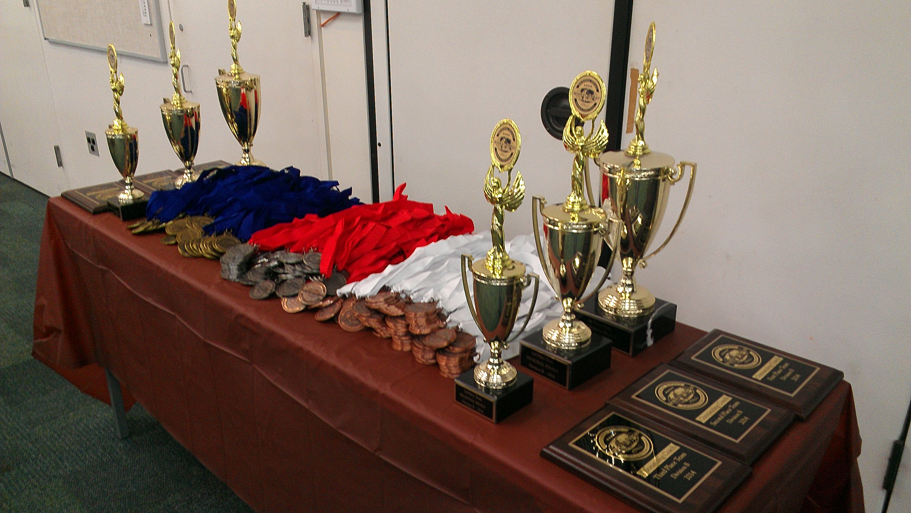
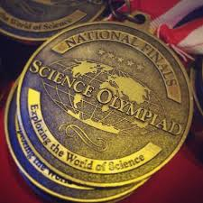
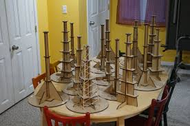

  
  
  

The Science Olympiad is an event/competition that is held every year where highschools and middleschools compete against each other. Each school has a team of unlimited students that select a topic that they want to compete in. The catch is that each student that decides to compete must selected three topics to compete in. Each topic they choose to compete must have two man teams competing in it. The official Science Olympiad website will give you what you will need to learn for each topic at the start of every season. It is up to your team to study up on that material until the day of the competition. The competition mainly consists of an hour long test on you topic or a hands on activity/ experiment on your topic. In every season, there will be a total of two or three competitions, (third competition is for states, assuming you place first in the first two). The first competition is called the Invitationals. Here schools are practicing what it is like competing against each other with actual places on the line. The second (more important) competition is called the Regionals. Here is where they will decide which school with be competing in the States competition(if you get first place). 

In the Science Olympiad, the three topics that I chose to compete in was Human Anatomy, Protein Modeling, and Environmental Impacts. The Environmental Impacts topic got dropped during the end of the season due to the unpopularity of the topic. For the Human Anatomy topic, throughout the season I studied about the names of the bones in our bodies, the classification of different degree burns, the anatomy of the skin, anatomy of the hair, the anatomy of the nail, the nervous system, and the brain system. During the actual competiton, me and my teammate shared equal responsibility on filling out test questions. In the end, our team placed third in invitationals, and fourth in regionals for the Human Anatomy topic. For the second topic, Protein Modeling, we had to learn about a single unique protein in our bodies. What we needed to know was the history behind the discovery of the protein, how that protein affects our bodies, the minerals that the protein is made of, build a model of it in a computer, and actually build a real life model with the correct pieces. The catch for this is that the software used to model the protein won't be given to us beforehand, we would have to learn how to use it during the test. During the actual competition, my partner handled the test part while I modeled the protein and built it. In the end, we placed third in invitationals and fifth in regionals. 

From this experience, I learned more about the human body than I did before. I learned about how our bodies move the way they do and the problems that may come to those body parts. I understand which parts of our bodies are used during various activities and how to prevent them from wearing out. For Protein Modeling, I learned/ experienced how to learn something in a set amount of time. Trying to figure out how the software works in the set amount of time we had really had me thinking and make me perform under pressure. But the main important lesson that I learned in this was that teamwork is valuable. Without my teammate, I wouldn't have made it far. 

More information on Science Olympiad [here.](https://www.hsso.org/).
